# 內建戰術說明

> 21 套內建進攻戰術（`src/plays/library.ts`），由程式產生，不要手改（改完執行 `npm run plays-doc`）。
> 跳投戰術有中距離、弧外兩個出手點；Spain Pick and Roll 還可以改傳給下順的掩護者在禁區出手。戰術庫依球隊能力與設定把每個出手點都模擬一次，選分數高的；每個出手點的圖都列在下面。
> 圖是用遊戲本身的路線與防守 AI 畫的：藍隊標角色字母 A / B / C，紅點是防守 AI 在該分鏡**開始時**的位置（預設身高 175 cm、換防），虛線圓是跑位終點，橘色小球是球。
> 線條：實線箭頭＝跑位、波浪線＝運球、虛線＝傳球、T 字＝掩護、點狀弧線＋圈＝投籃。
> 說明中的分數以 FIBA 3x3 計：弧線（半徑 6.75 m）以內 1 分、以外 2 分；一般規則是 2 / 3 分。

## 目錄

1. [高位擋拆-Pull-up Jumper](#1-高位擋拆-pull-up-jumper)
2. [高位擋拆-Floater](#2-高位擋拆-floater)
3. [高位擋拆-Drive to Rim](#3-高位擋拆-drive-to-rim)
4. [高位擋拆-Pick and Pop](#4-高位擋拆-pick-and-pop)
5. [高位擋拆-Pick and Roll](#5-高位擋拆-pick-and-roll)
6. [高位擋拆-Spain Pick and Roll](#6-高位擋拆-spain-pick-and-roll)
7. [低位擋拆-Paint Shot](#7-低位擋拆-paint-shot)
8. [低位擋拆-Pick and Roll](#8-低位擋拆-pick-and-roll)
9. [空切-Pass and Cut](#9-空切-pass-and-cut)
10. [空切-Backdoor Cut](#10-空切-backdoor-cut)
11. [無球掩護-Down Screen](#11-無球掩護-down-screen)
12. [無球掩護-Back Screen](#12-無球掩護-back-screen)
13. [無球掩護-Post Split](#13-無球掩護-post-split)
14. [無球掩護-Flare Screen](#14-無球掩護-flare-screen)
15. [手遞手-DHO to Drive](#15-手遞手-dho-to-drive)
16. [手遞手-DHO to Shoot](#16-手遞手-dho-to-shoot)
17. [手遞手-Fake Hand-Off](#17-手遞手-fake-hand-off)
18. [手遞手-Chicago](#18-手遞手-chicago)
19. [單打-Top Isolation](#19-單打-top-isolation)
20. [單打-Post Isolation](#20-單打-post-isolation)
21. [單打-Hunting the Mismatch](#21-單打-hunting-the-mismatch)

## 1. 高位擋拆-Pull-up Jumper

持球者繞過高位掩護後，在罰球線延伸處急停跳投。

| 角色 | 任務 | 推薦時看重 |
|---|---|---|
| **A**（開局持球） | 持球者 | 中距離投射 ×3、單打 ×2 |
| **B** | 掩護者 | 身高 ×1 |
| **C** | 拉開空間 | 弧外投射 ×1 |

**參考影片**：[擋拆教學](https://www.youtube.com/watch?v=IULh8LwbDZE)、[籃球教學 - Pick&Roll擋拆攻擊](https://www.youtube.com/watch?v=B_Ofn946hXo)

**出手點：中距離**

**終結**：A 擋拆後急停跳投　**時間**：約 3.0 秒，第 2.4 秒出手

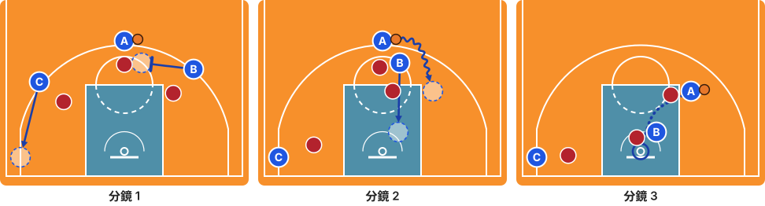

1. B 上提到 A 的防守者右側設掩護；C 往左底角拉開空間。
2. A 從 B 外側繞過掩護往右運球，在罰球線延伸處急停；B 先站住擋人，再下順把防守者帶離。
3. A 在弧內急停跳投（1 分）。

### 另一個出手點：弧外

持球者繞過高位掩護後，在弧外急停跳投。終結者改看重：弧外投射 ×3、單打 ×2。

**終結**：A 擋拆後弧外急停跳投　**時間**：約 3.3 秒，第 2.4 秒出手

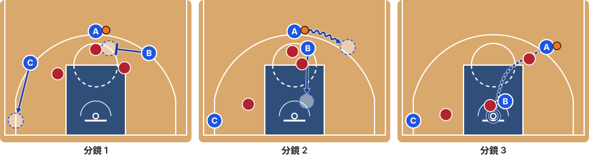

1. B 上提到 A 的防守者右側設掩護；C 往左底角拉開空間。
2. A 從 B 外側繞過掩護往右運球，在弧外急停；B 先站住擋人，再下順把防守者帶離。
3. A 在弧外急停跳投（2 分）。

## 2. 高位擋拆-Floater

持球者繞過掩護切進禁區，在長人補防前拋投。

| 角色 | 任務 | 推薦時看重 |
|---|---|---|
| **A**（開局持球） | 持球者 | 禁區終結 ×3、速度 ×2、單打 ×1 |
| **B** | 掩護者 | 弧外投射 ×1 |
| **C** | 拉開空間 | 弧外投射 ×1 |

**參考影片**：[擋拆教學](https://www.youtube.com/watch?v=IULh8LwbDZE)、[籃球教學 - Pick&Roll擋拆攻擊](https://www.youtube.com/watch?v=B_Ofn946hXo)

**終結**：A 切入拋投　**時間**：約 3.3 秒，第 2.8 秒出手

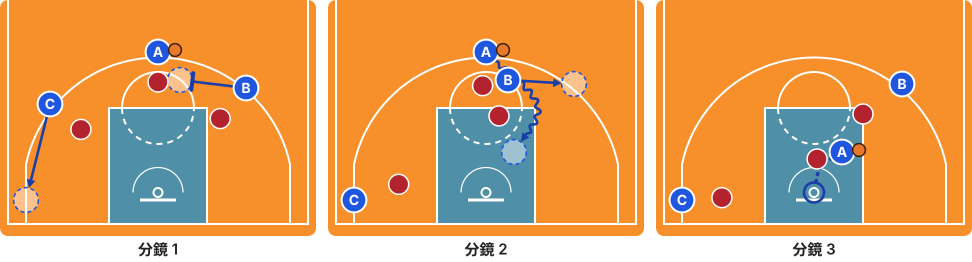

1. B 上提到 A 的防守者右側設掩護；C 往左底角拉開空間。
2. A 從 B 外側繞過掩護，再往禁區運球；B 先站住擋人，再往 A 的右後方（弧頂左側）拉開，不擋切入路線。
3. A 在禁區拋投（1 分）。

## 3. 高位擋拆-Drive to Rim

持球者繞過掩護一路切到籃下上籃。

| 角色 | 任務 | 推薦時看重 |
|---|---|---|
| **A**（開局持球） | 持球者 | 速度 ×3、禁區終結 ×3、單打 ×2 |
| **B** | 掩護者 | 弧外投射 ×1 |
| **C** | 拉開空間 | 弧外投射 ×1 |

**參考影片**：[擋拆教學](https://www.youtube.com/watch?v=IULh8LwbDZE)、[籃球教學 - Pick&Roll擋拆攻擊](https://www.youtube.com/watch?v=B_Ofn946hXo)

**終結**：A 切入上籃　**時間**：約 3.6 秒，第 3.1 秒出手

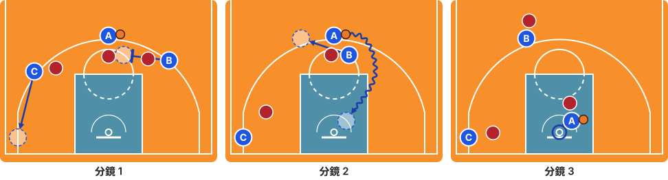

1. B 上提到 A 的防守者右側設掩護；C 往左底角拉開空間。
2. A 從 B 外側繞過掩護，一路運球切到籃下；B 先站住擋人，再往 A 的右後方（弧頂左側）拉開，清空切入路線。
3. A 上籃（1 分）。

## 4. 高位擋拆-Pick and Pop

掩護後，掩護者往外彈到弧頂，接球投兩分球。

| 角色 | 任務 | 推薦時看重 |
|---|---|---|
| **A**（開局持球） | 持球者 | 單打 ×1 |
| **B** | 掩護者 | 弧外投射 ×3 |
| **C** | 拉開空間 | 弧外投射 ×1 |

**參考影片**：[新北國王湯瑪士 Pick & Pop](https://www.youtube.com/watch?v=5SUNHcFeGj4)

**出手點：弧外**

**終結**：B 外彈接球投籃　**時間**：約 3.7 秒，第 2.7 秒出手

1. B 上提到 A 的防守者右側設掩護；C 往左底角拉開空間。
2. A 從 B 外側繞過掩護往右運球，吸引防守；B 先站住擋人，再往左外彈到弧外。
3. A 回傳給外彈的 B。
4. B 弧外投籃（2 分）。

### 另一個出手點：中距離

掩護後，掩護者往外彈到罰球線附近，接球投中距離。終結者改看重：中距離投射 ×3。

**終結**：B 外彈到中距離接球投籃　**時間**：約 3.4 秒，第 2.7 秒出手

1. B 上提到 A 的防守者右側設掩護；C 往左底角拉開空間。
2. A 從 B 外側繞過掩護往右運球，吸引防守；B 先站住擋人，再往左外彈到罰球線左側。
3. A 回傳給外彈的 B。
4. B 在罰球線左側中距離投籃（1 分）。

## 5. 高位擋拆-Pick and Roll

掩護後，掩護者轉身下順到籃下，接球上籃。

| 角色 | 任務 | 推薦時看重 |
|---|---|---|
| **A**（開局持球） | 持球者 | 單打 ×1 |
| **B** | 掩護者 | 禁區終結 ×3、身高 ×2 |
| **C** | 拉開空間 | 弧外投射 ×1 |

**參考影片**：[Pick＆Roll 擋拆小組配合](https://www.youtube.com/watch?v=puZxpKfcv7Y)、[How Pick And Roll In Basketball](https://www.youtube.com/watch?v=bwT15tI3H70)、[OVER THE TOP PASS TO ROLL MAN](https://www.youtube.com/watch?v=ZRY_dhTSWTM)

**終結**：B 下順接球上籃　**時間**：約 3.3 秒，第 2.8 秒出手

1. B 上提到 A 的防守者右側設掩護；C 往左底角拉開空間。
2. A 從 B 外側繞過掩護往右運球；B 先站住擋人，再轉身下順到籃下。
3. A 傳給下順的 B。
4. B 上籃（1 分）。

## 6. 高位擋拆-Spain Pick and Roll

高位擋拆後掩護者下順，第三人從背後擋住下順者的防守者，再外拉接球投籃。

| 角色 | 任務 | 推薦時看重 |
|---|---|---|
| **A**（開局持球） | 持球者 | 單打 ×1 |
| **B** | 掩護者（下順） | 禁區終結 ×2、身高 ×1 |
| **C** | 背掩護後外拉 | 弧外投射 ×3 |

**參考影片**：[三對三超實用戰術：西班牙擋拆](https://www.facebook.com/watch/?v=174199876616333)、[3x3 Playbook - Spanish Pick and Roll](https://www.youtube.com/watch?v=db22lmGpGbM)

**出手點：弧外**

**終結**：C 背掩護後外拉接球投籃　**時間**：約 4.9 秒，第 4.0 秒出手

1. B 上提到 A 的防守者右側設掩護；C 從左翼移到罰球線左側，準備背掩護。
2. A 從 B 外側繞過掩護往右運球；B 先站住擋人，再從右側繞往籃下順；C 往下到籃下附近，從背後擋住 B 的防守者。
3. C 背掩護後外拉到弧頂左側，A 傳給 C。
4. C 弧外投籃（2 分）。

### 另一個出手點：中距離

高位擋拆後掩護者下順，第三人從背後擋住下順者的防守者，再外拉到罰球線附近投中距離。終結者改看重：中距離投射 ×3。

**終結**：C 背掩護後外拉到中距離接球投籃　**時間**：約 4.4 秒，第 3.7 秒出手

1. B 上提到 A 的防守者右側設掩護；C 從左翼移到罰球線左側，準備背掩護。
2. A 從 B 外側繞過掩護往右運球；B 先站住擋人，再從右側繞往籃下順；C 往下到籃下附近，從背後擋住 B 的防守者。
3. C 背掩護後外拉到罰球線左側，A 傳給 C。
4. C 在罰球線左側中距離投籃（1 分）。

### 另一個出手點：禁區

高位擋拆後掩護者下順，第三人從背後擋住下順者的防守者，A 傳給順到籃下的掩護者。對方沉退時特別有效。改由 B 出手，看重：禁區終結 ×3、身高 ×1。

**終結**：B 下順到籃下接球出手　**時間**：約 4.5 秒，第 4.0 秒出手

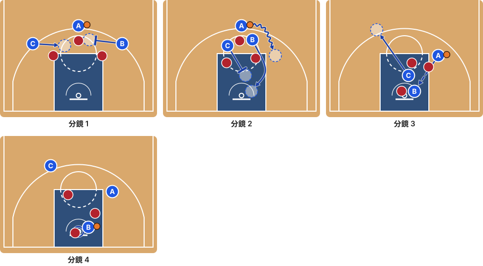

1. B 上提到 A 的防守者右側設掩護；C 從左翼移到罰球線左側，準備背掩護。
2. A 從 B 外側繞過掩護往右運球；B 先站住擋人，再從右側繞往籃下順；C 往下到籃下附近，從背後擋住 B 的防守者。
3. C 背掩護後外拉到弧頂左側，把自己的防守者帶開；A 傳給順到籃下的 B。
4. B 在籃下出手（1 分）。

## 7. 低位擋拆-Paint Shot

球傳進低位後，傳球者下來幫低位的人掩護，低位持球者趁防守者被擋住，運到禁區中路出手。

| 角色 | 任務 | 推薦時看重 |
|---|---|---|
| **A**（開局持球） | 傳入低位後掩護 | 身高 ×1 |
| **B** | 低位持球、禁區中路出手 | 禁區終結 ×3、單打 ×2、身高 ×1 |
| **C** | 拉開空間 | 弧外投射 ×1 |

**終結**：B 利用 A 的掩護到禁區中路出手　**時間**：約 3.0 秒，第 2.5 秒出手

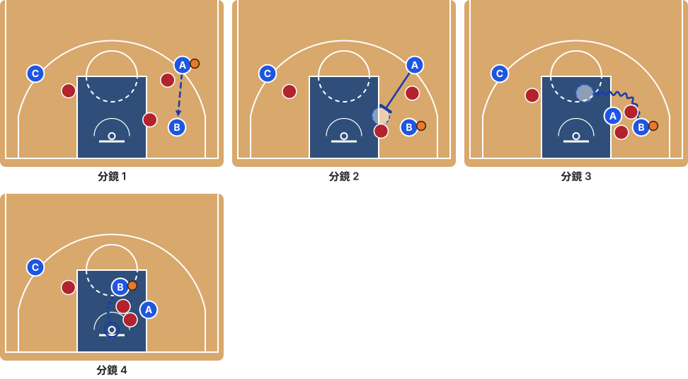

1. A 把球傳進右側低位的 B，B 成為持球者。
2. A 傳完往下走，到 B 的防守者靠中路那側設掩護。
3. B 從 A 外側繞過掩護，運到禁區中路停下；A 留在原地繼續擋住防守者。
4. B 在禁區中路出手（1 分）。

## 8. 低位擋拆-Pick and Roll

球傳到底角附近後，傳球者下來幫持球者掩護再順下，持球者切向中路後回傳給順下的人。

| 角色 | 任務 | 推薦時看重 |
|---|---|---|
| **A**（開局持球） | 傳球後掩護、順下 | 禁區終結 ×3、身高 ×2 |
| **B** | 低位持球者 | 單打 ×2 |
| **C** | 拉開空間 | 弧外投射 ×1 |

**終結**：A 掩護後順下接球上籃　**時間**：約 3.0 秒，第 2.5 秒出手

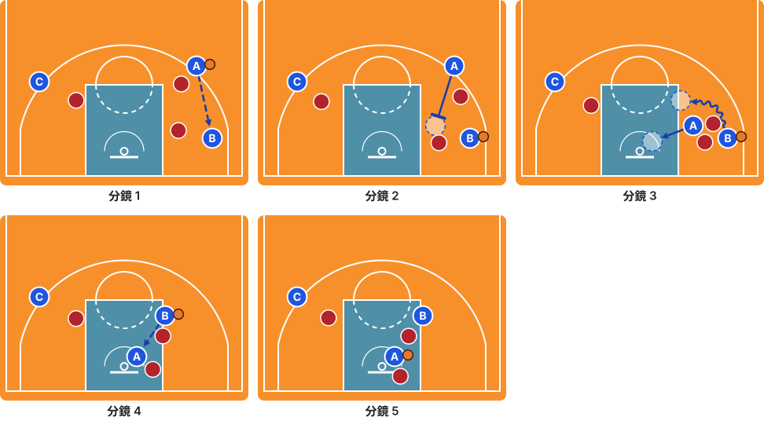

1. A 把球傳給右側低位（底角附近）的 B，B 成為持球者。
2. A 傳完往下走，到 B 的防守者靠中路那側設掩護。
3. B 繞過掩護往中路運球；A 先站住擋人，再轉身順下到籃下。
4. B 傳給順下的 A。
5. A 上籃（1 分）。

## 9. 空切-Pass and Cut

傳球後立刻往籃下切，接回傳上籃（傳切）。

| 角色 | 任務 | 推薦時看重 |
|---|---|---|
| **A**（開局持球） | 傳球後空切 | 速度 ×3、禁區終結 ×3 |
| **B** | 接球者 | 弧外投射 ×1 |
| **C** | 拉開空間 | 弧外投射 ×1 |

**參考影片**：[The Give-and-Go](https://www.youtube.com/watch?v=LOL5ZNuP7vk)

**終結**：A 切入接回傳上籃　**時間**：約 2.3 秒，第 1.8 秒出手

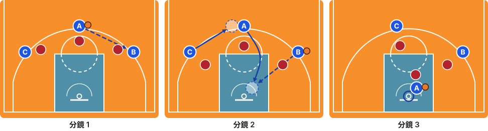

1. A 傳給右翼的 B。
2. A 傳完立刻往籃下切，B 抓準時機回傳，球和 A 同時到籃下；C 補到弧頂，保持空間。
3. A 上籃（1 分）。

## 10. 空切-Backdoor Cut

側翼先往外拉，把防守者帶出來，再突然往籃下背切。

| 角色 | 任務 | 推薦時看重 |
|---|---|---|
| **A**（開局持球） | 持球者 | — |
| **B** | 背切者 | 速度 ×3、禁區終結 ×3 |
| **C** | 拉開空間 | 弧外投射 ×1 |

**參考影片**：[The Backdoor Cut](https://www.youtube.com/watch?v=O4EX3P76h_U)、[NBA Cutting- Backdoor Cuts](https://www.youtube.com/watch?v=RzfXykjY_L4)

**終結**：B 背切接球上籃　**時間**：約 2.4 秒，第 1.9 秒出手

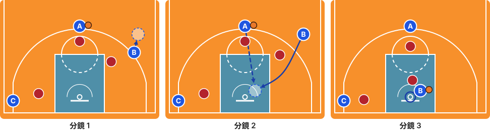

1. B 往外拉高，作勢要接球，把防守者帶離籃框。
2. B 突然轉身，從防守者背後往籃下切；A 抓準時機傳球，球和 B 同時到籃下。
3. B 上籃（1 分）。

## 11. 無球掩護-Down Screen

側翼往下幫低位的隊友掩護，隊友繞出來到側翼接球投籃。

| 角色 | 任務 | 推薦時看重 |
|---|---|---|
| **A**（開局持球） | 持球者 | — |
| **B** | 掩護者 | 身高 ×1 |
| **C** | 繞掩護接球 | 弧外投射 ×3、速度 ×1 |

**參考影片**：[無球擋拆影片分析 \| 下擋down screen進攻選項](https://www.youtube.com/watch?v=1HuVxCLThjM)

**出手點：弧外**

**終結**：C 繞下掩護接球投籃　**時間**：約 2.8 秒，第 1.8 秒出手

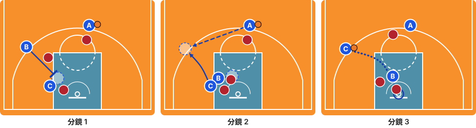

1. B 從左翼往下，到 C 的防守者上方設掩護（下掩護）。
2. C 繞過掩護往左翼跑到弧外，A 配合時機傳球；B 先站住擋人，再往禁區卡位。
3. C 弧外投籃（2 分）。

### 另一個出手點：中距離

側翼往下幫低位的隊友掩護，隊友繞出來到罰球線延伸處接球投中距離。終結者改看重：中距離投射 ×3、速度 ×1。

**終結**：C 繞下掩護接球投中距離　**時間**：約 2.4 秒，第 1.7 秒出手

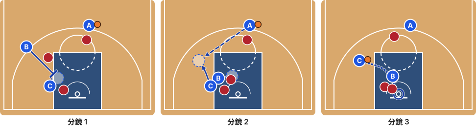

1. B 從左翼往下，到 C 的防守者上方設掩護（下掩護）。
2. C 繞過掩護往左側罰球線延伸處跑，A 配合時機傳球；B 先站住擋人，再往禁區卡位。
3. C 在罰球線延伸處中距離投籃（1 分）。

## 12. 無球掩護-Back Screen

在隊友的防守者背後（靠籃框那側）掩護，隊友往籃下空切。

| 角色 | 任務 | 推薦時看重 |
|---|---|---|
| **A**（開局持球） | 持球者 | — |
| **B** | 掩護者 | 身高 ×1 |
| **C** | 空切者 | 速度 ×2、禁區終結 ×3 |

**參考影片**：[4 High Set Play - Back Screen and Ball Screen Options](https://www.youtube.com/watch?v=2S8FFvIP9_U)

**終結**：C 背掩護空切上籃　**時間**：約 2.1 秒，第 1.6 秒出手

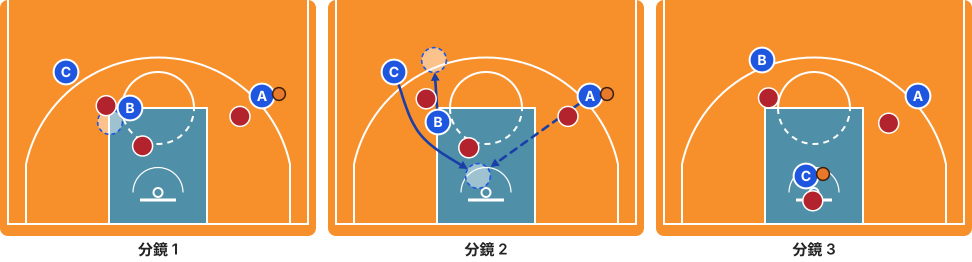

1. B 走到 C 的防守者背後（靠籃框那側）設掩護。
2. C 繞過掩護往籃下切，A 配合時機傳球；B 先站住擋人，再外彈到弧頂左側。
3. C 上籃（1 分）。

## 13. 無球掩護-Post Split

球傳進低位後，外圍兩人交叉掩護：A 先幫 C 掩護，C 繞過來後回頭幫 A 掩護，兩人互相擋住對方的防守者。

| 角色 | 任務 | 推薦時看重 |
|---|---|---|
| **A**（開局持球） | 傳入低位後掩護，再利用掩護外彈投籃 | 弧外投射 ×3 |
| **B** | 低位傳球 | 身高 ×2 |
| **C** | 繞過掩護後回頭幫 A 掩護，再往籃下切 | 禁區終結 ×1、速度 ×1 |

**參考影片**：[Golden State Offense - Post Split](https://www.youtube.com/watch?v=ivcb5niZ-PM)

**出手點：弧外**

**終結**：A 交叉掩護後外彈投籃（C 切入是第二選擇）　**時間**：約 4.8 秒，第 3.9 秒出手

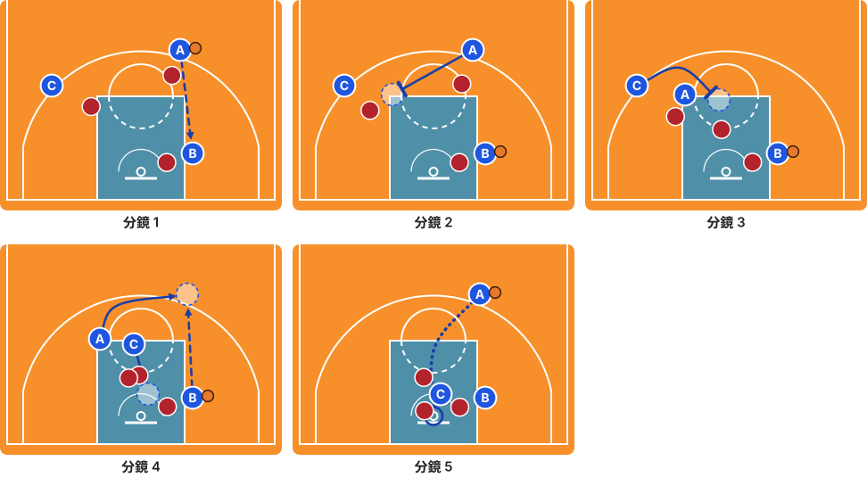

1. A 把球傳進右側低位的 B。
2. A 往左走，到 C 的防守者右側設掩護。
3. C 從 A 上方繞過掩護（C 的防守者被 A 擋住），停在 A 的防守者旁邊，回頭幫 A 掩護。
4. A 從 C 上方繞過掩護外彈到右側弧頂，B 配合時機傳給 A；C 先站住擋人，再往籃下切，製造第二個選擇。
5. A 弧外投籃（2 分）。

### 另一個出手點：中距離

球傳進低位後，外圍兩人交叉掩護：A 先幫 C 掩護，C 繞過來後回頭幫 A 掩護，A 外彈到罰球線投中距離。終結者改看重：中距離投射 ×3。

**終結**：A 交叉掩護後外彈到罰球線投籃（C 切入是第二選擇）　**時間**：約 4.4 秒，第 3.7 秒出手

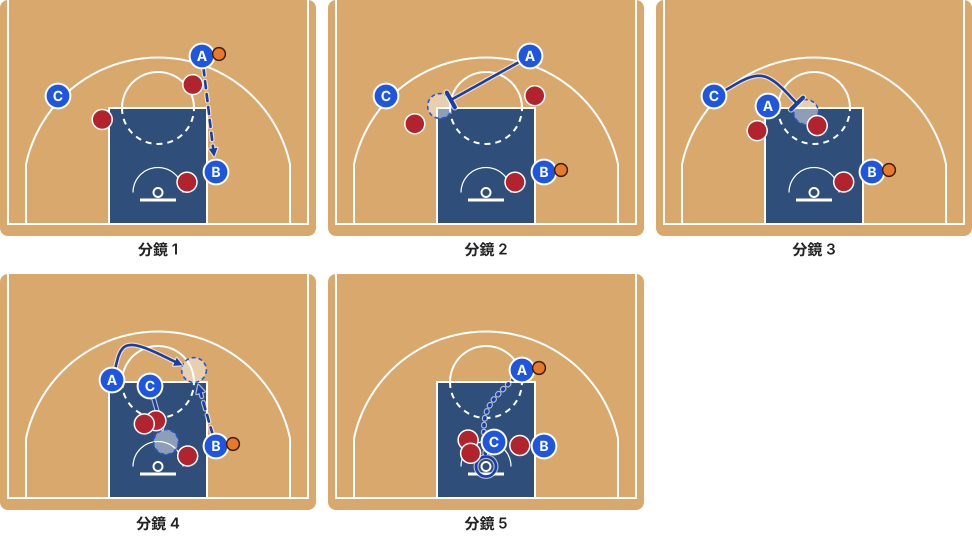

1. A 把球傳進右側低位的 B。
2. A 往左走，到 C 的防守者右側設掩護。
3. C 從 A 上方繞過掩護（C 的防守者被 A 擋住），停在 A 的防守者旁邊，回頭幫 A 掩護。
4. A 從 C 上方繞過掩護外彈到罰球線，B 配合時機傳給 A；C 先站住擋人，再往籃下切，製造第二個選擇。
5. A 在罰球線中距離投籃（1 分）。

## 14. 無球掩護-Flare Screen

持球者在一側時，弱邊的隊友幫射手設反向掩護，射手往遠離球的方向外拉接球投籃。

| 角色 | 任務 | 推薦時看重 |
|---|---|---|
| **A**（開局持球） | 持球者 | — |
| **B** | 反向掩護者 | 身高 ×1 |
| **C** | 外拉投籃 | 弧外投射 ×3、速度 ×1 |

**參考影片**：[林志傑 Flare Screen](https://www.youtube.com/watch?v=5g41UVABV0I)、[The BEST Way to Use Flare Screens in Basketball](https://www.youtube.com/watch?v=Fy_rEXaU4jM)

**出手點：弧外**

**終結**：C 利用反向掩護外拉接球投籃　**時間**：約 2.8 秒，第 1.8 秒出手

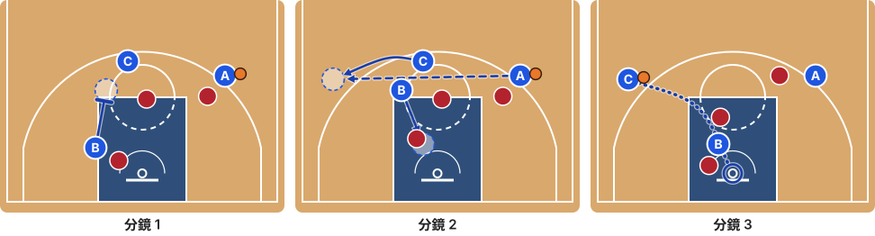

1. B 從左側低位上提，到 C 的防守者左側（遠離球的那側）設反向掩護。
2. C 從 B 上方繞過掩護，往遠離球的方向外拉到左翼弧外，A 配合時機傳球；B 先站住擋人，再往禁區走。
3. C 弧外投籃（2 分）。

### 另一個出手點：中距離

持球者在一側時，弱邊的隊友幫射手設反向掩護，射手外拉到罰球線延伸處接球投中距離。終結者改看重：中距離投射 ×3、速度 ×1。

**終結**：C 利用反向掩護外拉到中距離接球投籃　**時間**：約 2.6 秒，第 1.8 秒出手

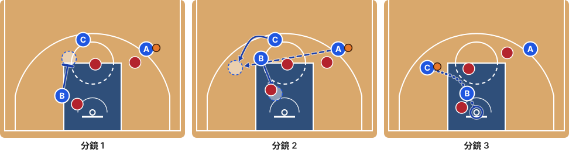

1. B 從左側低位上提，到 C 的防守者左側（遠離球的那側）設反向掩護。
2. C 從 B 上方繞過掩護，往遠離球的方向外拉到左側罰球線延伸處，A 配合時機傳球；B 先站住擋人，再往禁區走。
3. C 在罰球線延伸處中距離投籃（1 分）。

## 15. 手遞手-DHO to Drive

持球者運向側翼把球遞給跑上來的隊友，隊友繞過交球者往中路切入，交球者擋住追過來的防守者。

| 角色 | 任務 | 推薦時看重 |
|---|---|---|
| **A**（開局持球） | 手遞手給球者 | 身高 ×1 |
| **B** | 接球者 | 速度 ×3、單打 ×2、禁區終結 ×2 |
| **C** | 拉開空間 | 弧外投射 ×1 |

**參考影片**：[DHO: Dribble Pitch/Dribble Screen](https://www.youtube.com/watch?v=Oqzx1JElX5g)

**終結**：B 接手遞手後繞過 A 往中路切入上籃　**時間**：約 3.9 秒，第 3.4 秒出手

1. A 往右運球；B 從右底角往上跑，迎向 A。
2. A 把球遞給 B（手遞手）。
3. B 接球後從 A 外側（靠中場那側）繞過去，往中路切向籃下；A 轉身擋住追過來的防守者。
4. B 上籃（1 分）。

## 16. 手遞手-DHO to Shoot

手遞手後，接球者從交球者外側繞到弧頂，交球者擋住追上來的防守者，接球者投兩分球。

| 角色 | 任務 | 推薦時看重 |
|---|---|---|
| **A**（開局持球） | 手遞手給球者 | 身高 ×1 |
| **B** | 接球者 | 弧外投射 ×3、單打 ×1 |
| **C** | 拉開空間 | 弧外投射 ×1 |

**參考影片**：[DHO: Dribble Pitch/Dribble Screen](https://www.youtube.com/watch?v=Oqzx1JElX5g)

**出手點：弧外**

**終結**：B 繞過 A 到弧頂投籃　**時間**：約 3.5 秒，第 2.5 秒出手

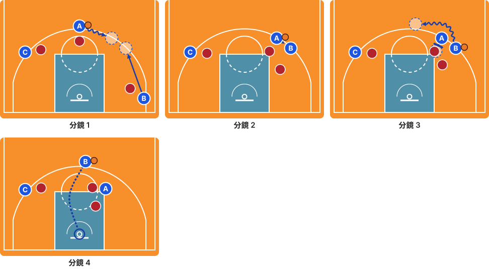

1. A 往右運球；B 從右底角往上跑，迎向 A。
2. A 把球遞給 B（手遞手）。
3. B 從 A 的外側（靠中場那側）繞過去，運球到弧頂；A 擋住追過來的防守者。
4. B 在弧頂的弧外投籃（2 分）。

### 另一個出手點：中距離

手遞手後，接球者從交球者外側繞過去，往罰球線運球，交球者擋住追上來的防守者，接球者投中距離。終結者改看重：中距離投射 ×3、單打 ×1。

**終結**：B 繞過 A 運到罰球線投中距離　**時間**：約 3.0 秒，第 2.4 秒出手

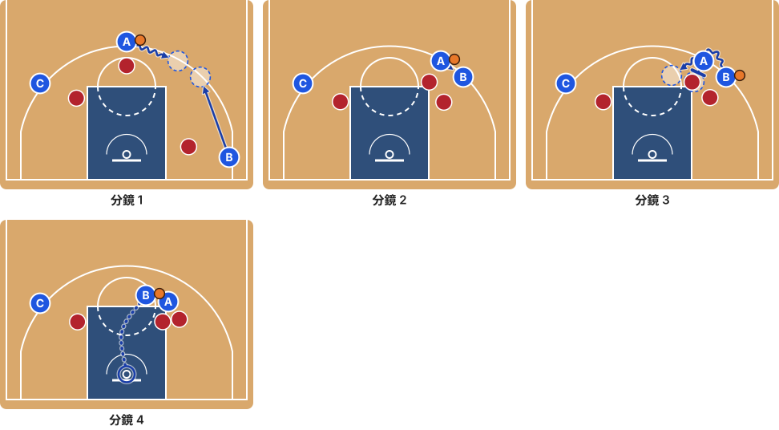

1. A 往右運球；B 從右底角往上跑，迎向 A。
2. A 把球遞給 B（手遞手）。
3. B 從 A 的外側（靠中場那側）繞過去，往罰球線運球；A 擋住追過來的防守者。
4. B 在罰球線附近中距離投籃（1 分）。

## 17. 手遞手-Fake Hand-Off

作勢要手遞手，交球者突然把球留著，自己轉身切入。

| 角色 | 任務 | 推薦時看重 |
|---|---|---|
| **A**（開局持球） | 假手遞手者 | 單打 ×3、禁區終結 ×2、速度 ×1 |
| **B** | 假接球者 | 速度 ×1 |
| **C** | 拉開空間 | 弧外投射 ×1 |

**參考影片**：[Fake Handoff Breakdown](https://www.youtube.com/watch?v=41sDICfHVlo)

**終結**：A 假遞後自己切入上籃　**時間**：約 2.8 秒，第 2.3 秒出手

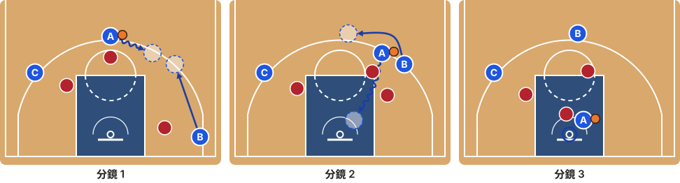

1. A 往右運球；B 從右底角往上跑，迎向 A，好像要接手遞手。
2. A 假裝交球，突然轉身往籃下切；B 從 A 的外側（靠中場那側）繞過去跑向弧頂，把防守者帶離切入路線。
3. A 上籃（1 分）。

## 18. 手遞手-Chicago

底角的射手先利用下掩護往上跑，再接持球者的手遞手，連續兩個掩護後投籃。

| 角色 | 任務 | 推薦時看重 |
|---|---|---|
| **A**（開局持球） | 手遞手給球者 | 身高 ×1 |
| **B** | 下掩護者 | 身高 ×1 |
| **C** | 連續利用掩護投籃 | 弧外投射 ×3、速度 ×1 |

**參考影片**：[籃球字典: ZOOM\|CHICAGO 戰術](https://www.youtube.com/watch?v=JWRnjldFXWQ)

**出手點：弧外**

**終結**：C 連續利用下掩護與手遞手後投籃　**時間**：約 4.3 秒，第 3.3 秒出手

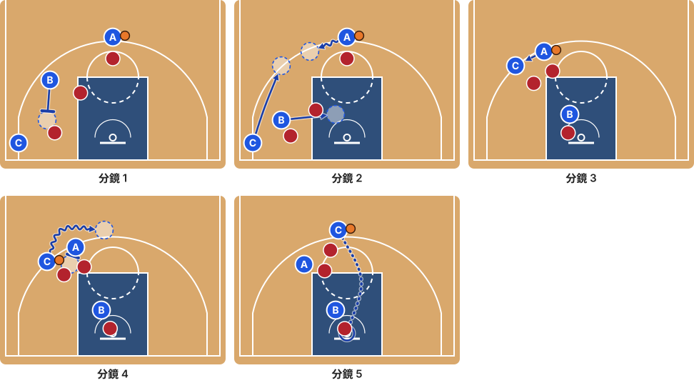

1. B 從左翼往下，到 C 的防守者上方設下掩護。
2. C 繞過下掩護往上跑到左翼；A 往左運球迎向 C；B 先站住擋人，再往禁區走。
3. A 把球遞給 C（手遞手）。
4. C 從 A 的外側（靠中場那側）繞過去，運球到弧頂；A 擋住追過來的防守者。
5. C 在弧頂的弧外投籃（2 分）。

### 另一個出手點：中距離

底角的射手先利用下掩護往上跑，再接持球者的手遞手，運到罰球線附近投中距離。終結者改看重：中距離投射 ×3、速度 ×1。

**終結**：C 連續利用下掩護與手遞手後運到罰球線投籃　**時間**：約 4.0 秒，第 3.3 秒出手

1. B 從左翼往下，到 C 的防守者上方設下掩護。
2. C 繞過下掩護往上跑到左翼；A 往左運球迎向 C；B 先站住擋人，再往禁區走。
3. A 把球遞給 C（手遞手）。
4. C 從 A 的外側（靠中場那側）繞過去，往罰球線運球；A 擋住追過來的防守者。
5. C 在罰球線附近中距離投籃（1 分）。

## 19. 單打-Top Isolation

兩個隊友拉到兩側底角清出空間，持球者在弧頂一對一切入。

| 角色 | 任務 | 推薦時看重 |
|---|---|---|
| **A**（開局持球） | 單打持球者 | 單打 ×3、禁區終結 ×2、速度 ×1 |
| **B** | 拉開空間 | 弧外投射 ×1 |
| **C** | 拉開空間 | 弧外投射 ×1 |

**終結**：A 弧頂一對一切入上籃　**時間**：約 3.2 秒，第 2.7 秒出手

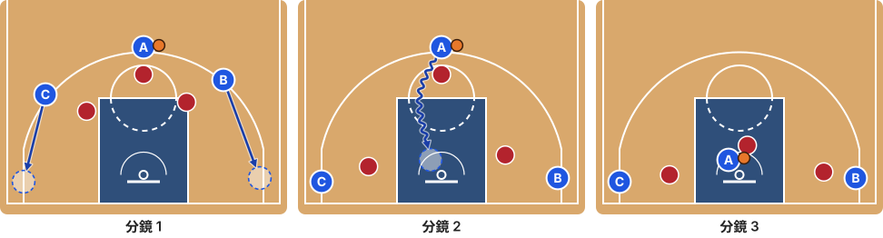

1. B、C 拉到兩側底角，把中間清空給 A。
2. A 一對一，往左運球後切向籃下。
3. A 上籃（1 分）。

## 20. 單打-Post Isolation

高個子到低位要位接球，隊友拉開到外圍，讓他在低位一對一。

| 角色 | 任務 | 推薦時看重 |
|---|---|---|
| **A**（開局持球） | 傳入低位 | 弧外投射 ×1 |
| **B** | 低位單打 | 身高 ×3、禁區終結 ×3、單打 ×2 |
| **C** | 拉開空間 | 弧外投射 ×1 |

**終結**：B 低位要位後轉身往禁區出手　**時間**：約 2.5 秒，第 2.0 秒出手

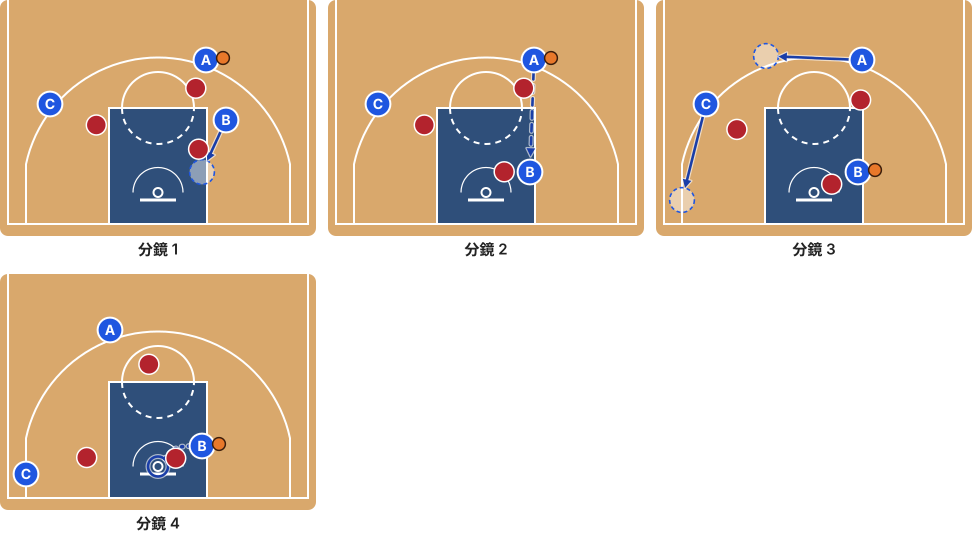

1. B 從罰球線右側往下，到右側低位（禁區線外緣）背框要位。
2. A 把球傳進低位的 B。
3. A 拉到弧頂左側、C 拉到左底角，清出空間；B 在低位一對一，轉身往禁區運一步。
4. B 在禁區轉身出手（1 分）。

## 21. 單打-Hunting the Mismatch

先用擋拆逼對方換防，讓持球者換到比較慢或比較矮的防守者，再一對一切入。若沒有成功換防（對方擠過），就變成一般的擋拆切入。

| 角色 | 任務 | 推薦時看重 |
|---|---|---|
| **A**（開局持球） | 單打持球者 | 單打 ×3、速度 ×2、禁區終結 ×1 |
| **B** | 掩護者（引出錯位） | 身高 ×1 |
| **C** | 拉開空間 | 弧外投射 ×1 |

**參考影片**：[球场上最常用的战术？如何快速形成错位？3种制造错位战术教程](https://www.youtube.com/watch?v=-naJ7vD3YgI)

**終結**：A 換防後對錯位的防守者切入　**時間**：約 4.1 秒，第 3.6 秒出手

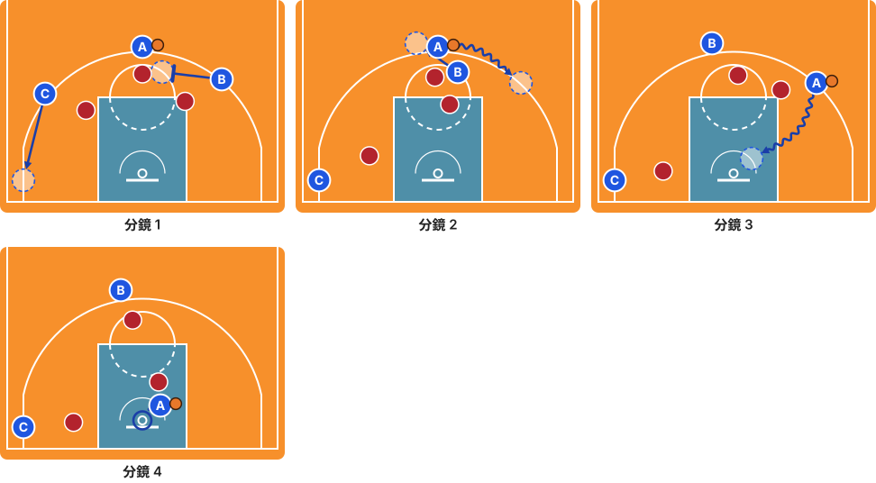

1. B 上提到 A 的防守者右側設掩護；C 往左底角拉開空間。
2. A 從 B 外側繞過掩護到右翼，逼對方換防；B 先站住擋人，再往弧頂拉開。
3. A 對換過來的防守者一對一，切向籃下。
4. A 上籃（1 分）。
